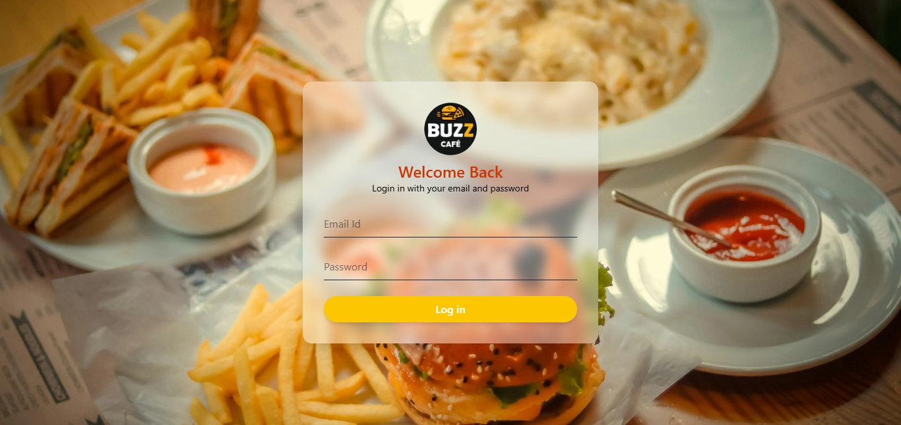
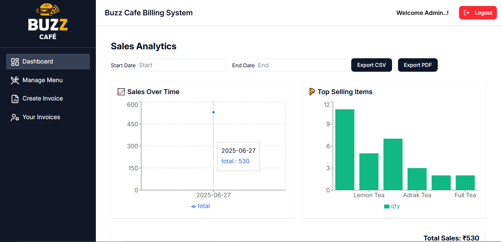
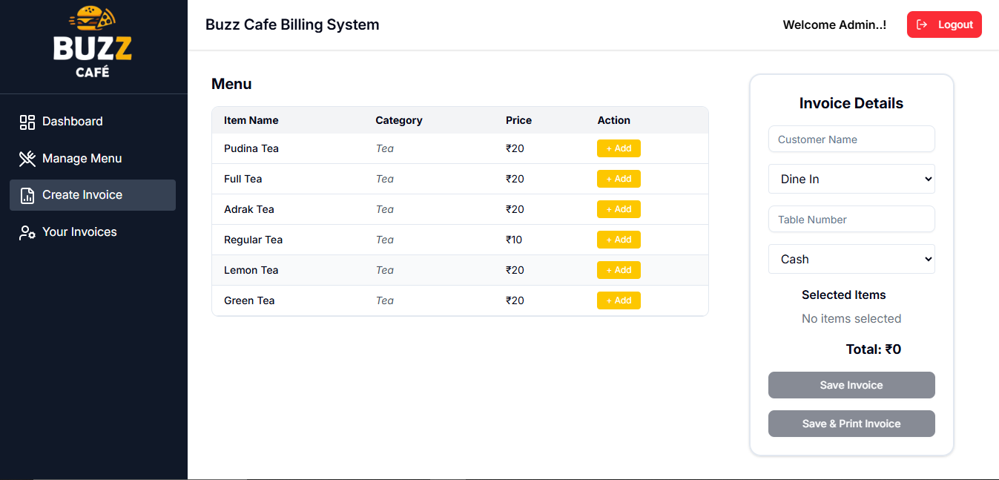
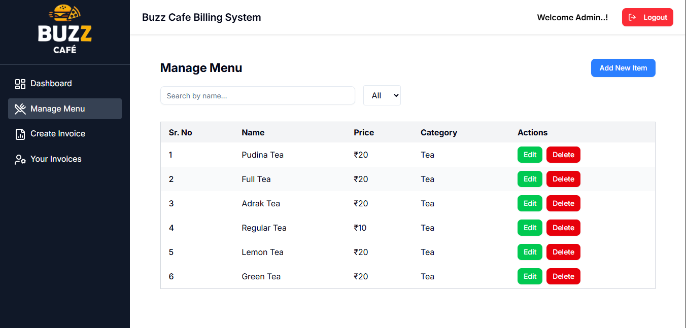
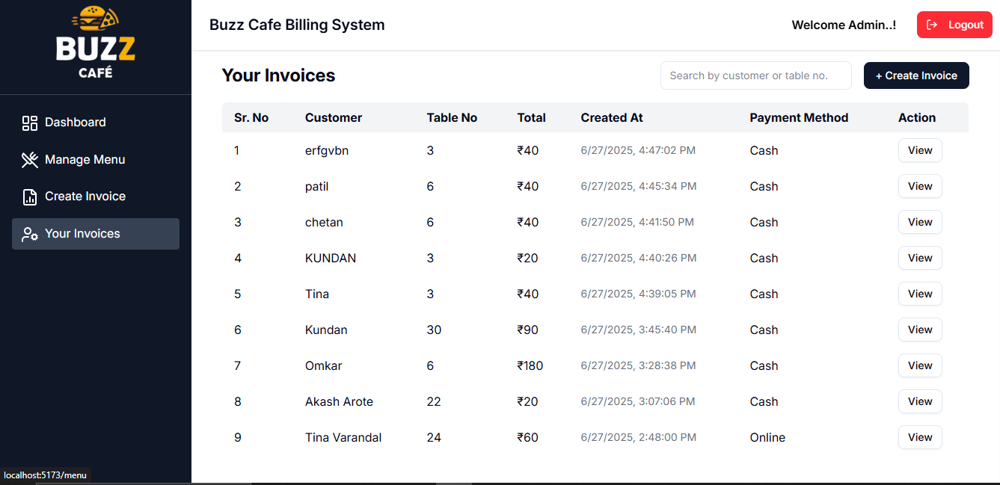

# ☕ Buzz Cafe Billing System

Buzz Cafe Billing System is a modern web-based application designed to simplify and digitize the billing process for cafes. It allows cafe staff to manage menu items, create and print invoices, and view analytics – all from an intuitive, responsive dashboard.

---

## 🚀 Features

### ✅ Core Functionalities
- 👤 **Login & Auth** – Secure login system for admins and cashiers (optional OTP/email auth)
- 📋 **Menu Management** – Add, update, and delete menu items with category & price
- 🧾 **Invoice Creation** – Create bills by selecting menu items with quantity control
- 🖨️ **Print Invoice** – Save and print invoice with auto layout and date-stamped formatting
- 🧮 **Billing History** – View all previous invoices with filter by date
- 📊 **Analytics Dashboard** – Sales stats, order trends, and best-selling items

### 📦 Optional Enhancements (Phase 6)
- 🧾 Export invoices as PDF or CSV
- 💸 Discount/coupon code system
- 🍽️ Table or Takeaway billing type
- 📱 Fully mobile responsive + PWA support

---

## 📁 Project Structure

```
buzz-cafe/
├── src/
│   ├── components/       # Reusable UI components
│   ├── pages/            # All routes/views (CreateInvoice, ManageMenu, PrintInvoice, etc.)
│   ├── layout/           # Layouts (AdminLayout, CashierLayout)
│   ├── firebase/         # Firebase config
│   ├── utils/            # Helper functions
│   └── App.jsx           # Main app component
├── public/               # Static assets
├── .env                  # Firebase & API keys
├── tailwind.config.js    # Tailwind CSS setup
└── vite.config.js        # Vite config
```

---

## 🛠️ Tech Stack

- **Frontend**: React.js, Tailwind CSS, Shadcn UI
- **State Management**: useState, useEffect, Context API
- **Backend**: Firebase Firestore (for data) + Auth
- **Build Tool**: Vite
- **Icons**: Lucide
- **Notifications**: react-toastify
- **PDF & CSV Export**: (Optional: jsPDF, papaparse)
- **Charts**: Recharts or Chart.js (Admin dashboard)

---

## 🖥️ Screenshots

### 🔐 Login Page


---

### 📊 Dashboard Overview


---

### 🧾 Invoice Creation


---

### 🍽️ Menu Management


---

### 📜 Billing History



## 📦 Installation

### 1. Clone the Repository

```bash
git clone https://github.com/your-username/buzz-cafe.git
cd buzz-cafe
```

### 2. Install Dependencies

```bash
npm install
```

### 3. Setup Firebase

- Create a project on [Firebase Console](https://console.firebase.google.com/)
- Enable **Firestore** and **Authentication**
- Copy your config into a `.env` file:

```
VITE_FIREBASE_API_KEY=your_key
VITE_FIREBASE_AUTH_DOMAIN=your_domain
VITE_FIREBASE_PROJECT_ID=your_project_id
VITE_FIREBASE_STORAGE_BUCKET=your_bucket
VITE_FIREBASE_MESSAGING_SENDER_ID=your_sender_id
VITE_FIREBASE_APP_ID=your_app_id
```

### 4. Start Development Server

```bash
npm run dev
```

Visit `http://localhost:5173` to view the app.

---

## 🧪 Usage Guide

1. **Login** as admin or cashier
2. Navigate to **Manage Menu** and add items
3. Go to **Create Invoice** and select items for billing
4. Choose Dine In or Takeaway, enter customer info
5. Click **Save** or **Save & Print Invoice**
6. Go to **Billing History** or **Dashboard** for analytics

---

## ✨ Upcoming Features

- [ ] User role management system
- [ ] Daily/weekly/monthly sales reports
- [ ] QR-based ordering for customers
- [ ] Offline invoice caching with IndexedDB

---

## 🤝 Contributing

Contributions are welcome! Please open an issue or PR for features, bugs, or suggestions.

---

## 📄 License

This project is licensed under the [MIT License](LICENSE).

---

## 🙌 Acknowledgments

- [Firebase](https://firebase.google.com/)
- [React](https://reactjs.org/)
- [Shadcn UI](https://ui.shadcn.com/)
- [Lucide Icons](https://lucide.dev/)
- [Tailwind CSS](https://tailwindcss.com/)